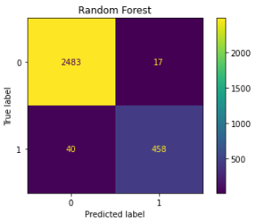

# Google Advanced Data Analytics Capstone: Employee Turnover Prediction
## Overview 
This is the capstone project for __Google Advanced Data Analytics Professional Certificate__. This project aimed to create a predictive model either through multiple logistic regression or through machine learning algorithms such as Decision Trees and Random Forests. This project utilized employee statistics from the fictional company Salifot Motors.
The best model for this analysis was a random forest model with tuned hyperparameters. The metrics below display the model's success on the testing dataset:
| Model Name | Precision | Recall | F1 Score | Accuracy | ROC AUC |
| :----------: | :---------: | :------: | :--------: | :--------: | :---: |
| Random Forest (cross-validated) | 96.4% | 92.0% | 94.1% | 98.0% | 95.6% |

The most relevant variables in the random forest model are `satisfaction_level`, `number_project`, `last_evaluation`, `tenure`, and `average_monthly_hours`.
## Business Understanding
Salifort’s senior leadership team is concerned about how many employees are leaving the company. Salifort strives to create a corporate culture that supports employee success and professional development. Further, the high turnover rate is costly in the financial sense as Salifort makes a big investment in recruiting, training, and upskilling its employees. If Salifort could predict whether an employee will leave the company, and discover the reasons behind their departure, they could better understand the problem and develop a solution.
## Data Understanding
The fictional company's data is HR_capstone_dataset.csv, which can be found on [Kaggle](https://www.kaggle.com/datasets/mfaisalqureshi/hr-analytics-and-job-prediction?select=HR_comma_sep.csv) and is under the [license](https://creativecommons.org/publicdomain/zero/1.0/). It contains approximately 15k employees' self-reported information and 10 features per employee. The features include employee satisfaction, last performance review, number of projects the employee contributes to, average number of hours worked per month, tenure at the company, whether the employee had a work accident, whether the employee left the company, whether the employee was promoted in the last 5 years, department, and salary.
## Modeling and Evaluation
In this project, logistic regression, decision tree, and random forest models are constructed and compared through 4 metrics: precision, recall, F1 score, accuracy, and ROC AUC. The champion model is the random forest model with tuned hyperparameters. The figure below displays the confusion matrix of the random forest model. The label `0` represents the employee will stay, while the label `1` represents the employee will leave.

  

The random forest model is considered the most robust since it predicts significantly fewer false positives and false negatives.

The following figure displays the top 10 feature importances in the random forest model. The five variables `satisfaction_level`, `number_project`, `last_evaluation`, `tenure`, and `average_monthly_hours` are considered the most relevant features in predicting employee turnover.

  

